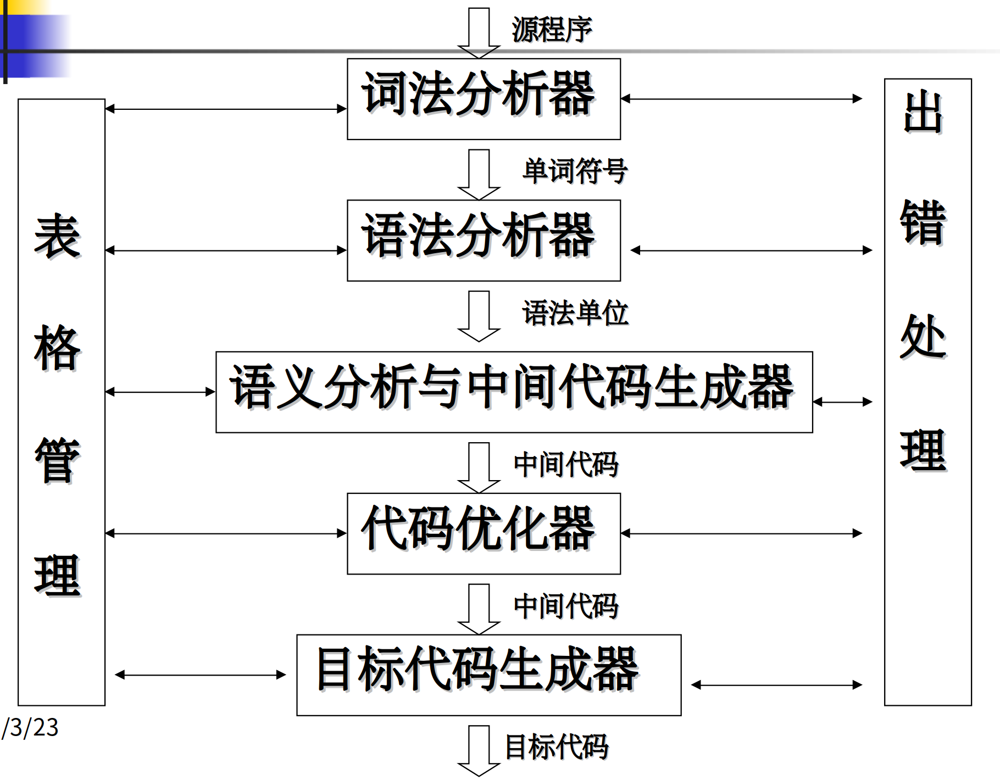

第一章：引论
===

> 0. 重难点
> 1. 程序设计语言
> 2. 程序设计语言的翻译
> 3. 编译程序的总体结构
> 4. 编译程序的组织
> 5. 编译程序的生成
> 6. 小结

## **0 重难点**

* **重点**：教学目的，教学要求，学习方法，课程的基本内容，编译系统的结构，编译程序的生成。
* **难点**： 编译程序的生成。

## **1 程序设计语言**

按抽象层次，可以分为机器语言、汇编语言、高级语言。外加一个命令式语言，控制系统工作，特点是功能封装。高级语言又可以分为三种。**强制式**，通过指明一系列可执行的运算及运算的次序来描述计算过程，比如FORTRAN、BASIC、Pascal、C……。**申诉式**，着重描述要处理什么，而非如何处理，如函数(应用)式语言LISP、ML等，逻辑式(基于规则)语言Prolog，Yacc等。**面向对象语言**。

## **2 程序设计语言的翻译**

* 翻译程序。将一种语言描述的程序翻译成另一种语言描述的程序的程序
* 解释程序。一边翻译一遍执行的翻译程序
* 编译程序。将源程序完整地转换成以文件形式存放的机器语言程序或汇编语言程序,然后再处理、执行的翻译程序
* 编译系统=编译程序+运行系统
* 程序设计语言=语言定义+编译系统

除了上面提到的两种，翻译程序还有很多种类，比如汇编程序、交叉汇编程序、反汇编程序、交叉编译程序、反编译程序、可变目标编译程序、并行编译程序、诊断编译程序、优化编译程序等。

## **3 编译程序总体结构**

编译程序的总体结构如下图所示：

### **3.1 词法分析**

由词法分析器（又称为扫描器）完成，主要任务为：从左到右扫描组成源程序的字符串，识别有效单词并将其表示成记号形式记法（登记为符号－类别对），查词法错误，进行标识符登记——符号表管理，删除无用符号。总的来说，就是输入源程序（字符串），输出种别码－属性值对。

### **3.2 语法分析**

由语法分析器（又叫Parser）完成，其功能主要是将词组成各类语法成分：表达式、因子、项，语句，子程序…，构造分析树，指出语法错误，制导翻译。总的来说，就是输入一个token序列，输出语法成分，比如语法树。

### **3.3 语义分析**

一般和语法分析同时进行，称为语法制导翻译，其功能是分析由语法分析器识别出来的语法成分的语义。包括获取标识符的属性：类型、作用域等；语义检查：运算的合法性、取值范围等；子程序的静态绑定：代码的相对地址；变量的静态绑定：数据的相对地址；

### **3.4 中间代码生成**

将实际中较为灵活的表达式等转化为一个易于处理的统一的形式。例如将算数表达式统一转换为前缀表达式。

### **3.5 代码优化**

对中间代码进行优化处理，使程序运行能够尽量节省存储空间，更有效地利用机器资源，使得程序的运行速度更快，效率更高。这种转换是等价的。包括机器无关优化，机器相关优化，局部优化，循环优化等。

### **3.6 目标代码生成**

将中间代码转换成目标机上的机器指令代码或汇编代码。包括确定源语言的各种语法成分的目标代码结构（机器指令组/汇编语句组），制定从中间代码到目标代码的翻译策略或算法等。

### **3.7 表格管理**

管理各种符号表(常数、标号、变量、过程、结构……)，查、填（登记、查找）源程序中出现的符号和编译程序生成的符号，为编译的各个阶段提供信息。符号表是一个数据结构，每个标识符在符号表中都有一条记录。

### **3.8 错误处理**

进行各种错误的检查、报告、纠正，以及相应的续编译处理(如：错误的定位与局部化)

### **3.9 模块分类**

以上的八个功能，每个功能都对应一个模块。

## **4 编译程序的组织**

根据系统资源的状况、运行目标的要求……等，可以将一个编译程序设计成多遍（Pass）扫描的形式，在每一遍扫描中，完成不同的任务。遍可以和阶段相对应，也可以和阶段无关。编译程序的设计目标是，规模小、速度快、诊断能力强、可靠性高、可移植性好、可扩充性好。通产分为前端和后端。

* 前端。与源语言有关、与目标机无关的部分，比如词法分析、语法分析、语义分析与中间代码生成、与机器无关的代码优化
* 后端。与目标机有关的部分，比如与机器有关的代码优化、目标代码生成

## **5 编译程序的生成**

第一个编译器是怎样被编译的？有两种可能的方式，其一是直接用可运行的代码编制，但是太费力；其二是自举，即使用语言提供的功能来编译该语言自身。

## **6 小结**

编译程序的编译过程有三个要素，其一是源程序的语言，其二是目标程序的语言，其三是编译程序的语言。可以描述为一个T形图，T的一横上是源程序和目标程序，在一竖的编译程序的作用下从前者转换为后者。