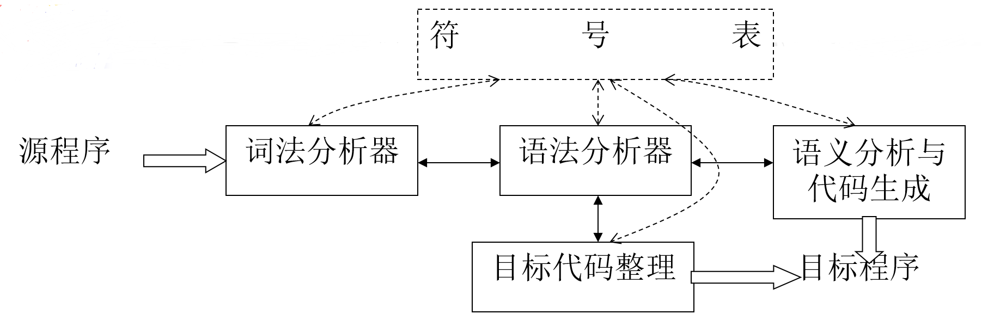

第三章 词法分析
===

> 0. 重难点
> 1. 词法分析器的功能
> 2. 单词的描述
> 3. 词法分析程序的自动生成
> 4. 小结

## **0 重难点**

**重点**：词法分析器的输入、输出；用于识别符号的状态转移图的构造。

**难点**：根据状态转移图实现词法分析器的设计

## **1 词法分析器的功能**

> 输入源程序，输出单词符号(token)，单词的内部形式是（种别，属性值）对。

种别码是可以自主设计的一种编码方案，本质上就是将单词分类。属性值就是指单词在计算机内部存放形式，通常是一个指针。

单词可以分为几大类，关键字、标识符、常数、运算符和分界符。其中关键字、界符、运算符通常是一字一码，因此种别码就足以标识它们，而对于标识符以及常数等用户自定义的单词，还需要一个指出他们存储位置的指针来标识。

**对源程序的输入缓冲和预处理**主要包括：超前搜索和回退、缓冲区、空白（无用）字符的剔除。

**词法分析阶段的错误处理**主要包括：非法字符检查、关键字拼写错误检查、不封闭错误检测、重复说明检查、错误恢复与续编译。其中，反复删掉剩余输入最前面的字符，直到词法分析器能发现一个正确的单词为止的方式，程为紧急错误恢复。

词法分析器所处的位置如下图所示，

在这个结构中，是以**语法分析器为中心**的，这样可以简化编译器的设计，提高编译器的效率，增强编译器的可移植性。

## **2 词法分析阶段的设计与实现**

大致可以分为两个阶段：
* 构造识别单词的DFA
* 编写词法分析程序

前者利用形式语言与自动机，主要看看后者。

根据画出的识别单词的状态转换图,构造词法分析程序,每个状态对应一段程序,完成到达此状态的工作。具体来讲，可以让一段程序对应识别一种类型的单词，也可以让一段程序对应于一个状态。

## **3 词法分析程序的自动生成**

如下图所示是利用Lex建立词法分析程序的过程。

Lex源程序分为三个部分，第一个部分是声明部分，包括常量定义和正规定义式；第二个部分是识别规则部分；第三个部分是辅助过程部分。

Lex是一个有二义性的文法，当存在二义性的时候，可以依据**最长匹配优先原则**或者是**优先匹配原则**（即按权值排序）进行处理。

Lex的原理如下图所示，实际上就是模拟一个DFA，来识别特定的正则文法。

值得**注意**的是，以上是Lex的构造原理，虽然是原理性的，但据此就不难将Lex构造出来；所构造出来的Lex是一个通用的工具，用它可以生成各种语言的词法分析程序，只需要根据不同的语言书写不同的LEX源文件就可以了；Lex不但能自动生成词法分析器，而且也可以产生多种模式识别器及文本编辑程序等。

## **4 小结**

* 词法分析器接收表示源程序的“平滑字符流”，输出与之等价的单词序列
* 单词被分成多个种类，并被表示成(种别，属性值)的二元组形式
* 为了提高效率，词法分析器使用缓冲技术，而且在将字符流读入缓冲区时，是经过剔除注解、无用空白符等预处理后的结果
* 单词的识别相当于正则语言的识别
* 词法的等价描述形式有正则文法、有穷状态自动机、正则表达式，其中有穷状态自动机可以用状态转换图表示
* 实现词法分析器时状态转换图是一个很好的设计工具，根据该图，容易构造出相应的分析程序
* 使用恰当的形式化描述，可以实现词法分析器的自动生成，Lex就是一种自动生成工具