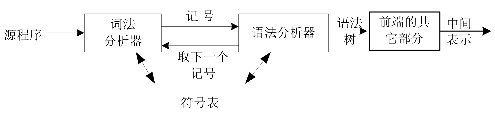
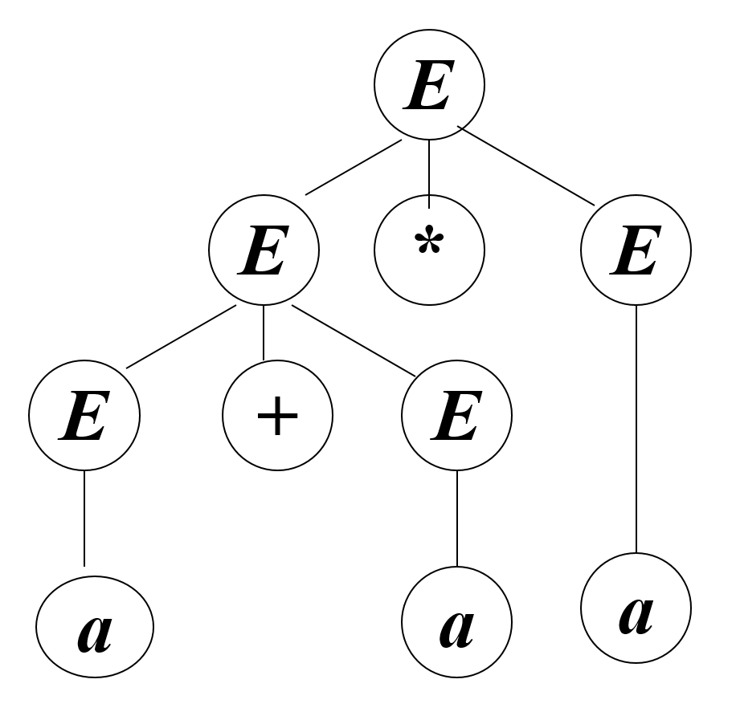
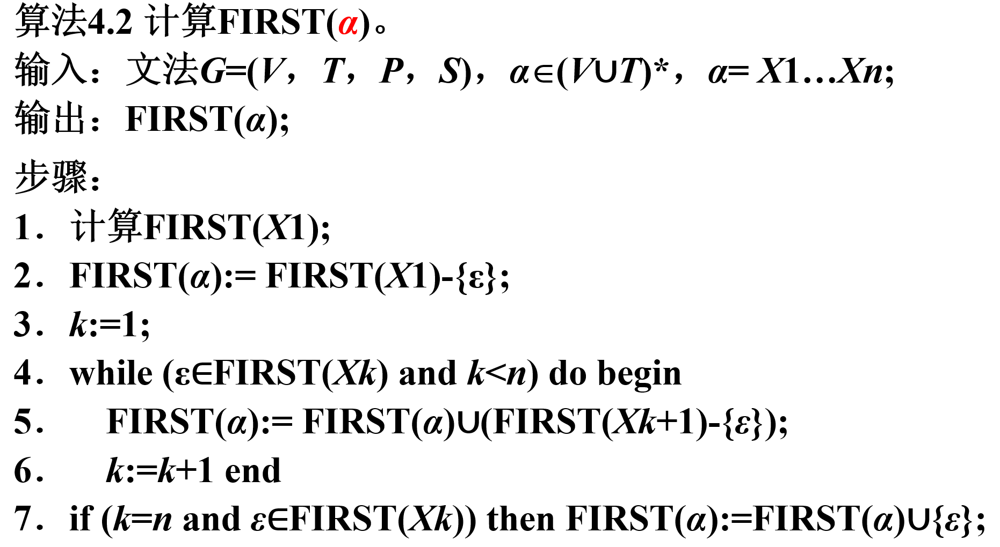
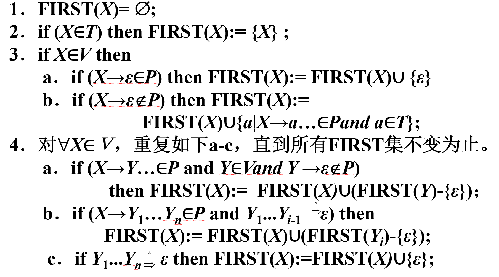
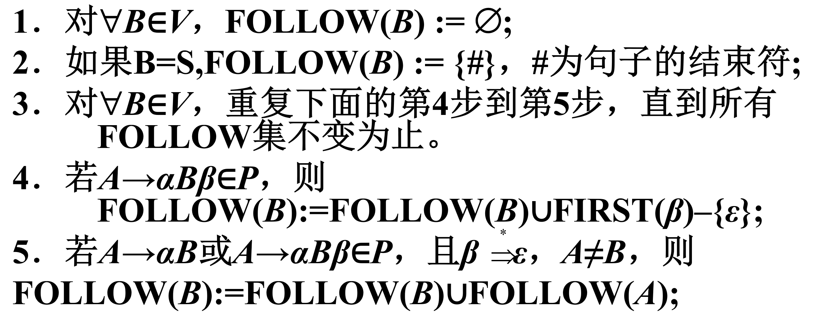
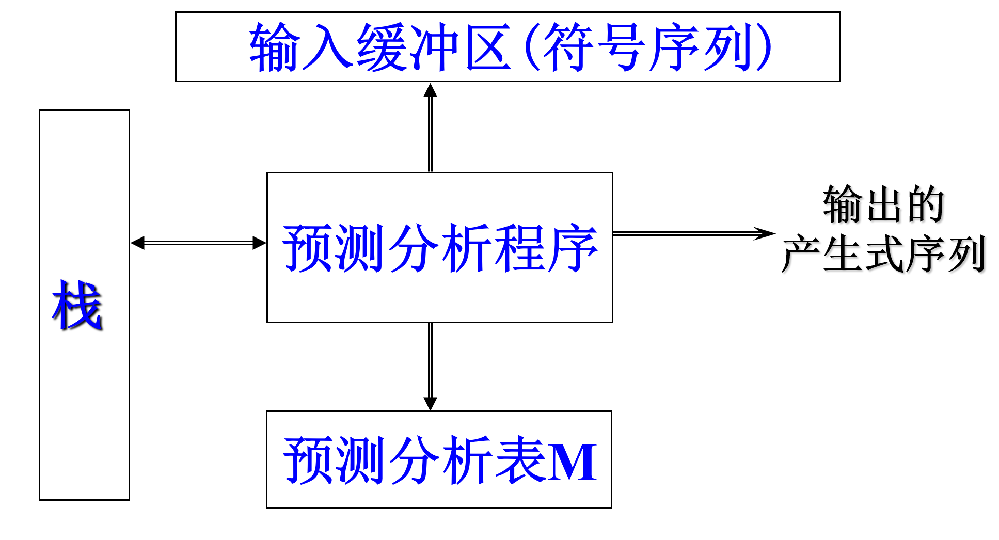

第四章 自顶向下的语法分析
===

> 0. 重难点
> 1. 语法分析概述
> 2. 自顶向下语法分析面临的问题与解决方法
> 3. 预测分析法
> 4. 递归下降分析法
> 5. 小结

## **0 重难点**

**重点**：自顶向下分析的基本思想，预测分析器总体结构，预测分析表的构造，递归下降分析法基本思想，简单算术表达式的递归下降分析器；

**难点**：FIRST 和 FOLLOW 集的求法，以及在构造LL(1)分析表时的使用；

## **1 语法分析概述**

语法分析(syntax analysis)是编译程序的核心部分，其任务是检查词法分析器输出的单词序列是否是源语言中的句子，亦即是否符合源语言的语法规则。为给定的终结符串（句子）构造一棵语法树的过程称为这个串（句子）的语法分析（parsing).下图是语法分析器在编译器中的位置。



语法分析有两大类技术：
* 自顶向下。用到的是推到技术，从根开始，逐步为某语句构造一棵语法树。在具体实现上，又分为递归子程序法和预测分析法（LL（1））。
* 自底向上。用到的是规约技术，将一句子归约为开始符号。具体实现时可以分为算符优先分析法、LR（0）、SLR（1）、LR（1）、LALR（1）。

这里假设文法是压缩的：即删除了单位产生式和无用产生式。

## **2 自顶向下的语法分析用到的技术、面临的问题及解决方法**

自顶向下语法分析的基本思想是从文法的开始符号出发，为输入符号串寻求一个最左推导。

### **2.1 自顶向下分析用到的技术**

这里先做几个定义。

**最左推导**：每次推导都施加在句型的最左边的语法变量上。这与最右规约对应。

**最右推导**：每次推导都施加在句型的最右边的语法变量上。

**语法树**：又称Parse Tree，用树的形式表示句型的生成，树根表示开始符号，中间节点表示非终结符，叶子节点表示终结符。每个推导都对应一个子树。如下图所示是一个语法树。



**短语**：一棵子树的所有叶子自左至右排列起来形成一个相对于子树根的短语。

**直接短语**：仅有父子两代的一棵子树，它的所有叶子自左至右排列起来所形成的符号串。

**句柄**：一个句型的分析树中最左面的直接短语。

**句子**：语法树的叶结点从左到右的排列，刚好是这个文法所产生的语言的一个句子。

### **2.2 自顶向下分析面临的问题**

**文法的二义性**：一个句子对应多个语法树。

**回溯问题**：文法中每个语法变量A的产生式右部称为A的候选式，如果A有多个候选式存在公共前缀，则自顶向下的语法分析程序将无法根据当前输入符号准确地选择用于推导的产生式，只能试探，当试探不成功时就需要退回到上一步推导，看A是否还有其它的候选式，这就是回溯(backtracking)。这种情况可以通过改写产生式来推迟这种决定，直到看见足够多的输入符号，可以作出正确选择为止。具体将采用提取左因子的方法来改造文法，以便减少推导过程中回溯现象的发生。

**左递归**：假设A是文法G的某个语法变量，如果存在推导$A \Rightarrow \alpha A \beta$，则称文法G是递归的。当$\alpha = \epsilon$时，即$A \Rightarrow A\beta$称之为左递归。如果$A \Rightarrow \alpha A \beta$至少需要两步推导，则称文法G是间接递归。左递归会让分析进入到无限循环之中。

### **2.3 解决方法**

对上下文无关文法进行改造。

#### **2.3.1 消除二义性**

改造的方法就是通过引入新的语法变量等，使文法含有更多的信息。其实，许多二义性文法是由于概念不清，即语法变量的定义不明确导致的。例如在算术表达式的问文法中，应该体现出不同运算的优先级。

在改造其他正则表达式时，也可以通过考虑不同推出式的优先级来消除二义性。

#### **2.3.2 消除左递归**

将含有左递归的表达式转换为右递归的式子。例如有如下的左递归的表达式：

$$ A\rightarrow A\alpha \mid \beta $$

可以转换为如下有递归表达式：

$$ A\rightarrow \beta A^{\prime} $$

这个转换的模式就是消除左递归的通用的模式。

在实际应用中，除了消除上面的直接左递归，还要注意消除间接左递归。所以通常会将所有的表达式进行一次推导。

#### **2.3.3 消除回溯**

消除回溯的方法就是提取左因子。对每个语法变量$A$，找出它的两个或更多候选式的最长公共前缀$\alpha$。如果$\alpha \ne \epsilon$，则对$A$的所有产生式提取左因子。

#### **2.3.4 LL(1)文法**

先来看两个问题

**问题一**：什么样的文法才能进行确定的自顶向下分析？

确定的自顶向下分析首先从文法的开始符号S出发，每一步推导都根据当前句型的最左语法变量A和当前输入符号a，选择A的某个候选式$\alpha$来替换A，并使得从$\alpha$推导出的第一个终结符恰好是a。

**问题二**：当A有多个候选式时，当前选中的候选式必须是惟一的。

第一个符号很重要。第一个符号是指符号串的第一个符号，并且是终结符号，可以称为首终结符号在自顶向下的分析中，它对选取候选式具有重要的作用。为此引入首符号集的概念。

**FIRST 集**。假设 $\alpha \in (V \cup T)^{*}$，从$\alpha$推导出的串的首符号集记作$FIRST(\alpha)$。

$$ FIRST(\alpha)=\{ a \mid \alpha \Rightarrow a\beta, a \in T, \beta \in (V \cup T)^{*} \} $$

如果$\alpha \Rightarrow \epsilon$，则$\epsilon \in FIRST(\alpha)$

$FIRST(\alpha)$的计算如下图所示



$FIRST(X)$的计算如下图所示



如果文法$G$中所有的$A$的产生式为$A \rightarrow \alpha_{1} \mid ...\mid \alpha_{m}$，并且$\epsilon \notin FIRST(\alpha_{1})\cup...\cup FIRST(\alpha_{m})$，并且$\forall i, j, 1 \le i,j \le m, i \ne j$，均有$FIRST(\alpha_{i}) \cap FIRST(\alpha_{j}) = \emptyset$，则对$G$的句子可以使用自顶向下的分析。

**FOLLOW 集**。如果存在$A\rightarrow \epsilon$这样的表达式，则需要定义该集合。

$$ FOLLOW(A)=\{ a \mid S\Rightarrow \alpha Aa \beta \}, a \in T, \alpha,\beta \in (V \cup T)^{*} $$

如果$A$是文法的开始符号，则其FOLLOW集为#。

$FOLLOW(B)$的计算如下



如果$\alpha_{j} \Rightarrow \epsilon$，那么如果$\forall i(1\le i \le m, i \ne j), FIRST(\alpha_{i}) \cap FOLLOW(A)=\emptyset$均成立，则可以对$G$的句子使用自顶向下的分析。

**LL(1)文法**：满足不含左递归、二义性；如果$G$的任意两个具有相同左部的产生式$A\rightarrow \alpha \mid \beta$，如果$\alpha, \beta$均不能推出$\epsilon$，则$FIRST(\alpha)\cap FIRST(\beta)=\emptyset$；如果$\alpha, \beta$有一个能推出$\epsilon$，假设$\beta \Rightarrow \epsilon$，则$FIRST(\alpha)\cap FOLLOW(A)=\emptyset$。则称$G$为LL(1)文法。其中，这里第一个L代表从左向右扫描输入符号串，第二个L代表最左推导，1代表在分析过程中每步推导都要向前查看一个输入符号。

## **3 预测分析法**

### **3.1 LL(1)预测分析程序的构成**

* 一个通用的控制算法
* 一个分析栈，#为栈底符号
* 一个输入缓冲区，#为输入串结束符
* 一个统一形式的分析表M

其结构如下图所示



在系统启动时，输入指针指向输入串的第一个字符;分析栈中存放着栈底符号#和文法的开始符号。根据栈顶符号A和读入的符号a，查看分析表M,以决定相应的动作。这样做的**优点**是效率高，并且便于维护和自动生成。这样做的**关键**在于分析表M的构造。

#### **3.1.1 预测分析程序的总控程序**

```
算法4.5 预测分析程序的总控程序。
输入：输入串w和文法G=(V, T, P, S)的分析表M;
输出：如果w属于L(G)，则输出w的最左推导，否则报告错误;
步骤：
1．将栈底符号#和文法开始符号S压入栈中;
2．repeat
3．		X:=当前栈顶符号;
4．		a:=当前输入符号;
5．		if X∈T∪{#} then
6．			if X=a then
7．		      	　{if X≠# then begin//没结束
8．					将X弹出栈; //匹配一个
9．					前移输入指针//输入符号
10．					end} 
11．			else error/输入没结束，栈空了
12．		else // X∈V
13．			if M[X, a]= X→ Y1Y2…Yk then begin
14．		    	将X弹出栈; /
15．			依次将Yk，…，Y2，Y1压入栈;
16．			输出产生式X→Y1Y2…Yk
                               //完成一次推导
17．			End
18．			else error
19．until X=#//栈为空 
20. If X=# and a=# then success else error
```

### **3.2 预测分析表的构造算法**

预测分析表的伪代码描述如下

```
算法4.6 预测分析表(LL(1)分析表)的构造算法。
输入：文法G;
输出：分析表M;
步骤：
1．对G中的任意一个产生式A→α, 执行第2步和第3步;
2． for 任意a属于{FIRST(α)-{ε}, 将A→α填入M[A, a];
3．
 if ε属于FIRST(α) then 任意a属于FOLLOW(A),将A→ε填入M[A, a];
4．将所有无定义的M[A, b]标上出错标志。
```

预测分析法的实现步骤可以描述如下：
* 构造文法
* 改造文法：消除二义性、消除左递归、提取左因子
* 求每个候选式的FIRST集和变量的FOLLOW集
* 检查是不是 LL(1) 文法
* 构造预测分析表
* 实现预测分析器

### **3.3 预测分析的错误恢复**

**发现错误**。栈顶的终结符与当前输入符不匹配；非终结符A位于栈顶，面临的输入符为a，但分析表M的M[A,a]为空

**“应急”恢复策略**。跳过输入串中的一些符号直至遇到“同步符号”为止。

**同步符号的选择**。把FOLLOW(A)中的所有符号作为A的同步符号；把FIRST(A)中的符号加到A的同步符号集；可以把表示语句开始的一些关键字加入到同步记号集中；如果栈顶的终结符不能被匹配，就可以弹出该终结符，此时相当于把所有的符号都看作同步符号；

## **4 递归下降分析法**

### **4.1 递归下降分析法的基本思想**

先来看一个假想。
* 为每个非终结符，编写一个可以递归调用的处理子程序，名字就是该非终结符
* 程序体按产生式的右端来编写：当遇到$X_k$是终极符号时直接进行匹配；当遇到$X_k$是语法变量时就调用$X$对应的处理子程序；

### **4.2 语法图和递归子程序法**

**语法图**即是状态转换图，语法分析器和词法分析器的状态转换图不同：每个非终结符对应一个状态转换图，边上的标记是记号和非终结符；记号上的转换意味着如果该记号是下一个输入符号，就应进行识别处理；非终结符A上的转换是对与A对应的过程的调用；

### **4.3 基于语法图的语法分析器工作方式**

* 初始时，分析器进入状态图的开始状态，输入指针指向输入符号串的第一个符号；
* 如果经过一些动作后，它进入状态s，且从状态s到状态t的边上标记了终结符a，此时下一个输入符又正好是a，则分析器将输入指针向右移动一位，并进入状态t；
* 另一方面，如果边上标记的是非终结符A，则分析器进入A的初始状态，但不移动输入指针；
* 一旦到达A的终态，则立刻进入状态t，事实上，分析器从状态s转移到状态t时，它已经从输入符号串“读”了A （调用A对应的过程）；
* 最后，如果从s到t有一条标记为ε的边，那么分析器从状态s直接进入状态t而不移动输入指针；

### **4.4 语法图的化简与实现**

* 左因子提取。将形如$A \rightarrow YX|YZ$的产生式替换为$A \rightarrow Y(X|Z)$
* 右因子提取。将形如$A \rightarrow YX|ZX$的产生式替换为$A \rightarrow (Y|Z)X$
* 右递归消除。将形如$A \rightarrow YX|Z$的产生式替换为$A \rightarrow Y^{*}Z$
* 左递归消除。将形如$A \rightarrow YX|YZ$的产生式替换为$A \rightarrow ZY^{*}$

### **4.5 递归子程序法的实现步骤**

* 构造文法
* 改造文法：消除二义性、消除左递归、提取左因子
* 求每个候选式的FIRST集和语法变量的FOLLOW集
* 检查G是不是 LL(1) 文法，若G不是 LL(1)文法，说明文法G的复杂性超过了自顶向下方法的分析能力，需要附加新的“信息”
* 按照LL(1)文法画语法图
* 化简语法图
* 按照语法图为每个语法变量设置一个子程序

递归子程序法的优点是直观、简单、可读性好，并且便于扩充。缺点就是实现效率低；处理能力相对有限；通用性差，难以自动生成。

## **5 小结**

* 自顶向下分析法和自底向上分析法分别寻找输入串的最左推导和最左归约
* 自顶向下分析会遇到二义性问题、回溯问题、左递归引起的无穷推导问题，需对文法进行改造：消除二义性、消除左递归、提取公共左因子
* LL(1)文法是一类可以进行确定分析的文法，利用FIRST集和FOLLOW集可以判定某个上下文无关文法是否为LL(1)文法
* LL(1)文法可以用LL(1)分析法进行分析
* 递归下降分析法根据各个候选式的结构为每个非终结符编写一个子程序
* 使用语法图可以方便地进行递归子程序的设计