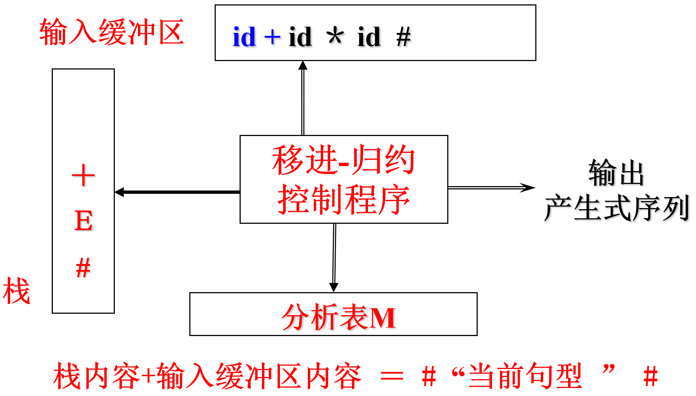

第五章 自底向上的语法分析
===

> 0. 重难点
> 1. 自底向上的语法分析概述
> 2. 算符优先分析法
> 3. LR分析法
> 4. 语法分析程序的自动生成工具Yacc
> 5. 小结

## **0 重难点**

**重点**：自底向上分析的基本思想，算符优先分析法的基本思想。LR 分析器的基本思想，LR分析算法，规范句型活前缀及其识别器——DFA，LR(0)分析表的构造，SLR(1)分析表的构造, LR(1)分析表的构造。

**难点**：规范句型活前缀，LR项目闭包与项目集规范族。 

## **1 自底向上的语法分析概述**

**基本思想**：自左向右逐个扫描输入串，一边把输入符号移入分析栈，一边检查位于栈顶的一串符号是否与某个产生式的右部相同。如果相同，就把栈顶的这串符号归约为左部的非终结符；不同，则继续移入输入符号，进行判断。上述过程一直重复到输入串结束，栈内恰好为S。

自底向上的语法分析对应着最右推导，也叫最右规约。为了实现这个目的，就需要寻找句型中的当前归约对象——“句柄”进行归约。按照不同的寻找句柄的方法，可以分为**算符优先分析法**和**状态法**。

这里先再来重复几个概念：

**短语**：一棵子树的所有叶子自左至右排列起来形成一个相对于子树根的短语。

**直接短语**：仅有父子两代的一棵子树，它的
所有叶子自左至右排列起来所形成的符号串。

**句柄**：一个句型的分析树中最左面的直接短语。

### **1.1 移进-归约分析**

系统分为四个部分：输入缓冲区、分析表、分析栈、控制程序。系统的结构如下图所示：

分析器中有四种动作：移进，将下一输入符号移入栈；规约，用产生式左侧的非终结符替换栈顶的句柄（某产生式右部）；接受，分析成功；拒绝，出错处理；

在移进规约中，存在一些问题。
* 移进归约冲突。既可以移进，也可以规约
* 归约归约冲突。有不同的规约方式

要解决这两个问题，实际上就是要解决对句柄的识别。那么如何识别句柄呢？或者换成两个等价的问题，如何保证找到的直接短语是最左的？如何确定句柄的开始和结束处？

有两个方法，即优先法和状态法。

### **1.2 优先法**

根据归约的先后次序为句型中相邻的文法符号规定优先关系：句柄内相邻符号同时归约，是同优先的；句柄两端符号的优先级要高于句柄外与之相邻的符号。定义了这种优先关系，程序就可以根据优先级的变化来确定句柄的头和尾了。

### **1.3 状态法**

句柄是逐步形成的。用状态来描述不同时刻下形成的那部分句柄；因为句柄是产生式的右部，可用产生式来表示句柄的不同识别状态。采用这种方法，语法分析程序根据当前的分析状态就可以确定句柄的头和尾，并进行正确的归约。

## **2 算符优先分析法**

来源于算术表达式分析的启示。方法就是将句型中的终结符号当作“算符”，借助于算符之间的优先关系确定句柄。

先做几个定义：

**算符文法**。如果文法G不存在形如 $A\rightarrow \alpha BC \beta$ 的产生式，即文法Ｇ中不存在具有相邻非终结符的产生式，则称之为算符优先文法。

**相邻**。如果$S\Rightarrow ...ab...,or\;S \Rightarrow ...aQb...$，则称a、b相邻。只有相邻的终结符之间才会有关系。

**优先关系**。假设G是一个不含ε-产生式的文法，A、B和C均是G的语法变量，G的任何一对终结符a和b之间的优先关系定义为：
* $a\equiv b$，当且仅当存在产生式$A \rightarrow ...ab...,or\;A\rightarrow ... aBb...$
* $a \nless b$，当且仅当存在产生式$A \rightarrow ...aB...,and(\;B \rightarrow b..., or\;B \rightarrow Cb...)$
* $a \ngtr b$，当且仅当存在产生式$A \rightarrow ...Bb...and(\;B \rightarrow ...a, or\;B \rightarrow ...aC)$
* a与b无关系，当且仅当a与b在G的任何句型中都不相邻

### **2.1 算符优先文法**

设 $G=（V，T，P，S）$ 是OG，如果 $\forall a, b \in T, a \equiv b, a \nless b, a \ngtr b$ 至多有一个成立，则称之为算符优先文法。

### **2.2 算符优先矩阵的构造**

